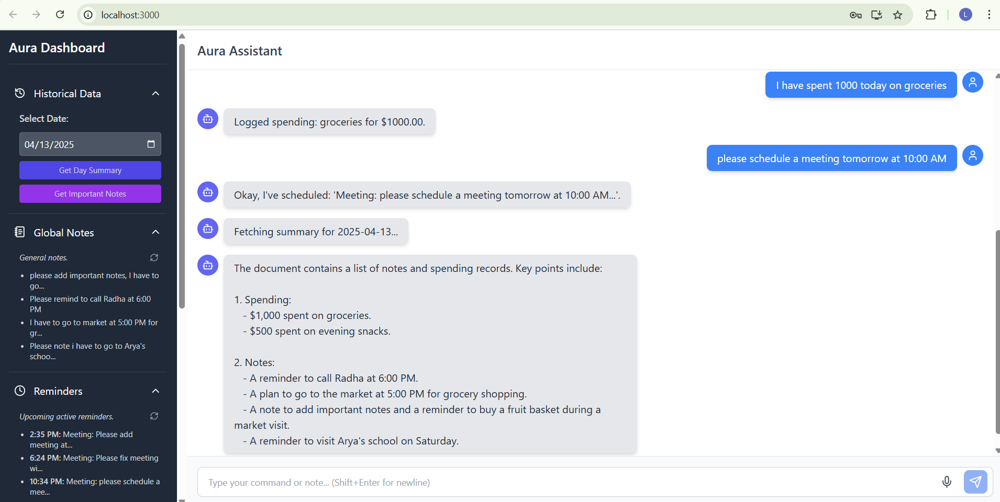

# Aura Project

## Overview
Aura is a full-stack application that consists of a FastAPI backend and a React frontend. The project is designed to manage user authentication, notes, reminders, and summarization features.

## Project Structure
The project is organized into two main directories: `backend` and `frontend`.

### Backend
The backend is built using FastAPI and includes the following components:

- **Alembic**: Contains migration scripts for managing database schema changes.
- **API**: The main API router and versioning, with endpoints for authentication, user management, notes, and processing.
- **Core**: Core application logic, including configuration and security utilities.
- **CRUD**: Functions for creating, reading, updating, and deleting database records.
- **Database**: Database models and session management using SQLAlchemy.
- **Schemas**: Pydantic schemas for data validation and serialization.
- **Services**: Business logic and integrations with external services.
- **Tests**: Unit and integration tests for the application.

### Frontend
The frontend is built using React and includes the following components:

- **Public**: Static assets, including the main HTML entry point.
- **Src**: Main application source code, including components, contexts, hooks, services, and styles.
- **Assets**: Static assets used within components.
- **Components**: Reusable UI components organized by common, layout, and feature-specific categories.
- **Contexts**: React Context providers for managing global state.
- **Hooks**: Custom hooks for managing state and API interactions.
- **Services**: API interaction layer for making requests to the backend.
- **Styles**: Global styles and Tailwind CSS configuration.

## Getting Started

### Prerequisites
- Python 3.7 or higher
- Node.js and npm

### Backend Setup
1. Navigate to the `backend` directory.
2. Create a virtual environment and activate it.
3. Install the required dependencies:
   ```
   pip install -r requirements.txt
   ```
4. Set up environment variables in the `.env` file.
5. Run the application:
   ```
   uvicorn main:app --reload
   ```

### Frontend Setup
1. Navigate to the `frontend` directory.
2. Install the required dependencies:
   ```
   npm install
   ```
3. Start the development server:
   ```
   npm run dev
   ```

## Contributing
Contributions are welcome! Please open an issue or submit a pull request for any enhancements or bug fixes.

## License
This project is licensed under the MIT License. See the LICENSE file for more details.

Screenshots:

